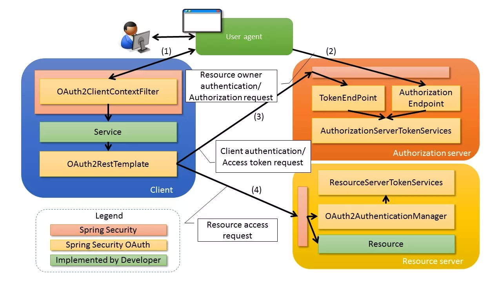
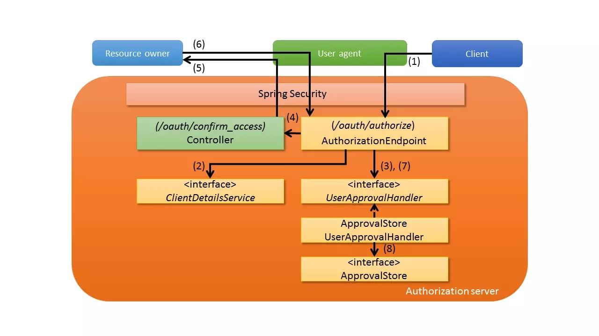
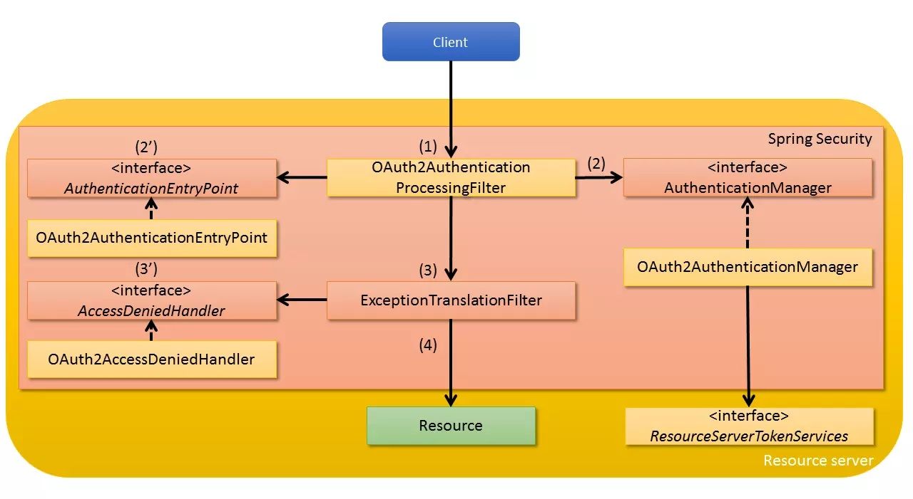
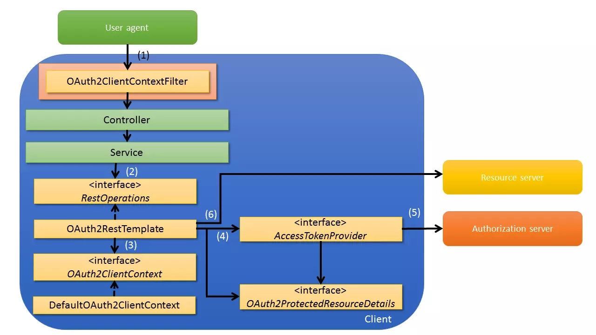
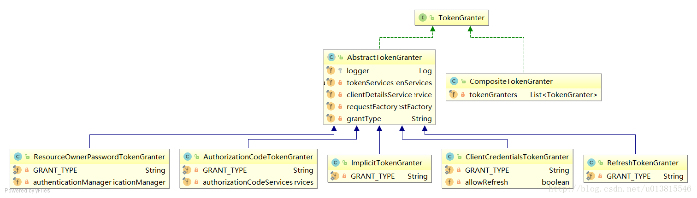

Spring Cloud Oauth
===

### 项目运行
1. 启动 oauth-server
2. 密码模式授权

### Oauth2 架构

1. **Oauth-Server**
    
    - AuthorizationEndpoint /oauth/authorize：授权端点
    - TokenEndpoint /oauth/token：令牌端点
    - WhitelabelApprovalEndpoint /oauth/confirm_access：用户确认授权提交端点
    - WhitelabelErrorEndpoint /oauth/error：授权服务错误信息端点
    - CheckTokenEndpoint /oauth/check_token：用于资源服务访问的令牌解析端点
    - TokenKeyEndpoint /oauth/token_key：提供公有密匙的端点，如果使用JWT令牌的话
    
2. **Oauth-Resource**
    
3. **Oauth-Client**
    

### Grant Type 授权模式

TokenGranter 五个实现类分别对应物种授权模式
 - ResourceOwnerPasswordTokenGranter : password 密码模式
 - AuthorizationCodeTokenGranter : authorization_code 授权码模式
 - ClientCredentialsTokenGranter : client_credentials 客户端模式
 - ImplicitTokenGranter : implicit 简化模式
 - RefreshTokenGranter : refresh_token 刷新token

### 参考资料
1. [简单理解OAuth 2.0](https://juejin.im/post/5b3b3b61f265da0f955ca780)
4. [Spring-Security-OAuth2架构及源码浅析](https://juejin.im/post/5b3f283af265da0f6012ef30)
1. [Spring Cloud OAuth2 实现单点登录](https://www.jianshu.com/p/ea0a7d89f5f0)
2. [Spring Cloud OAuth2 搭建授权服务](https://www.cnblogs.com/fp2952/p/8973613.html)
3. [Spring Security Oauth2 之 架构源码解读](https://blog.csdn.net/wuzhiwei549/article/details/79808509)

### 参考项目
1. [基于Spring Security 5的OAuth2通用登录模块](https://gitee.com/dgut-sai/security-oauth2)